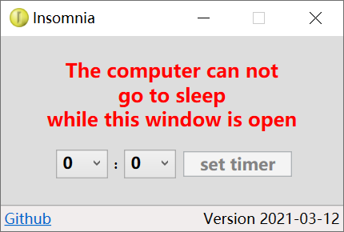

# insomnia.exe

Prevent Windows from going to sleep. Very handy in some situations. 

For example, I have a PC at home sleeping in normal times. Occasionally I wake it up 
from outside (Wake-On-LAN) and remote desktop to it to do something intermittently. 
With insomnia.exe I can keep my PC awake. Original version of insomnia.exe 
can simply prevent Windows from sleeping. I added a stop timer to it, so when 
I forget to close insomnia.exe or the internet connection is lost, the timer will 
close it for me. It reserves some time to allow stuff to be done on my PC, 
while the PC is able to sleep for power savings eventually. 

The stop timer is added in dotNET version, not yet in Native version.

